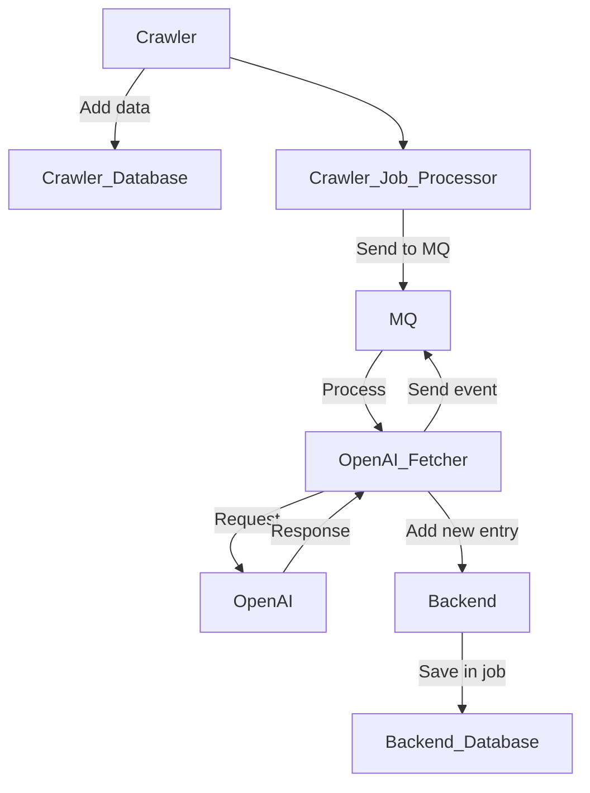

```mermaid

graph TD
    Crawler -->|Add data| Crawler_Database
    Crawler --> Crawler_Job_Processor
    Crawler_Job_Processor -->|Send to MQ| MQ
    OpenAI_Fetcher -->|Send event| MQ
    MQ -->|Process| OpenAI_Fetcher
    OpenAI_Fetcher -->|Request| OpenAI
    OpenAI -->|Response| OpenAI_Fetcher
    OpenAI_Fetcher -->|Add new entry| Backend
    Backend -->|Save in job| Backend_Database

```
