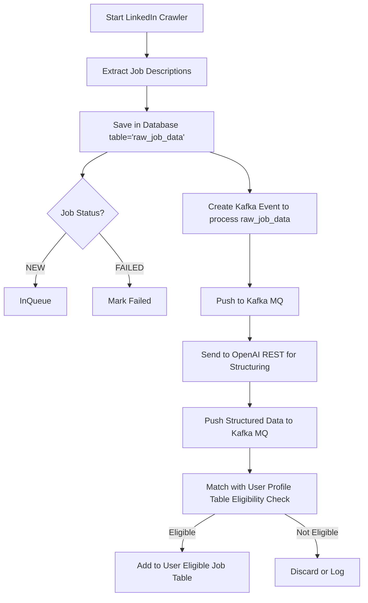

```mermaid

flowchart TD
    A[Start LinkedIn Crawler] --> B[Extract Job Descriptions]
    B --> C[Save in Database table='raw_job_data']
    C --> G[Create Kafka Event to process raw_job_data]
    C --> D{Job Status?}
    D -->|NEW| E[InQueue]
    D -->|FAILED| F[Mark Failed]
    G --> H[Push to Kafka MQ]
    H --> I[Send to OpenAI REST for Structuring]
    I --> J[Push Structured Data to Kafka MQ]
    J --> L[Match with User Profile Table Eligibility Check]
    L -->|Eligible| M[Add to User Eligible Job Table]
    L -->|Not Eligible| N[Discard or Log]
```
